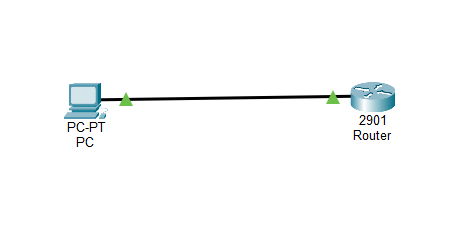

# SSH Remote Access Project (Upgrade from Telnet) - Cisco Packet Tracer

## 📌 Project Overview
This project demonstrates how to configure **SSH (Secure Shell)** for secure remote access to a router using Cisco Packet Tracer. It is an upgraded version of the Telnet project, where insecure remote access is replaced with encrypted communication.

SSH allows secure management of network devices by encrypting data during transmission, preventing unauthorized access and interception.

---

## 🧱 Network Design
- 1 Router  
- 1 PC  
- Direct connection between PC and Router  

### 📡 Connection
- PC (FastEthernet0) → Router (GigabitEthernet0/0)

---

## ⚙️ Configuration Steps

### 1. Router Interface Configuration
- Assigned IP address to router interface  
- Enabled the interface using `no shutdown`  

### 2. Basic SSH Requirements
- Configured hostname  
- Configured domain name  
- Created local user credentials  

### 3. SSH Configuration
- Generated RSA keys for encryption  
- Enabled SSH version 2  
- Configured VTY lines for SSH access only  

### 4. PC Configuration
- Assigned IP address in the same network  
- Configured default gateway  

### 5. Remote Access using SSH
- Accessed router securely from PC using SSH command  

---

## 🖥️ IP Addressing

### Router
- Interface: g0/0  
- IP Address: 192.168.1.1  
- Subnet Mask: 255.255.255.0  

### PC
- IP Address: 192.168.1.2  
- Subnet Mask: 255.255.255.0  
- Default Gateway: 192.168.1.1  

---

## 💻 CLI Configuration

### 🔹 Router Configuration (SSH)
```bash
enable
configure terminal

hostname R1
ip domain-name lab.local

interface g0/0
ip address 192.168.1.1 255.255.255.0
no shutdown
exit

username admin password cisco

crypto key generate rsa
1024

ip ssh version 2

line vty 0 4
login local
transport input ssh
exit

end
write memory
```
### 🔹 Verification Command

- Check Connectivity (from PC)
```bash
ping 192.168.1.1
```

- Access Router using SSH (from PC)
```bash
ssh -l admin 192.168.1.1
```

- Verify SSH Status
```bash
enable
show ip ssh
```
## 📸 Network Topology


---
## ✅ Testing & Verification
- Verified connectivity using ping
- Successfully accessed router using SSH
- Verified secure login using username and password
- Confirmed Telnet access is disabled
- Verified SSH using show ip ssh

---

## 🧠 Skills Learned
- Secure remote access using SSH
- Difference between Telnet and SSH
- RSA key generation for encryption
- VTY configuration for secure access
- Authentication using username and password
- Network troubleshooting 

---

## 🔄 Project Evolution
- Version 1: Telnet Remote Access (Insecure) 
- Version 2: Upgraded to SSH (Secure Remote Access)
---

## 📂 Project File
- ssh-remote-access-project.pkt

---

## 📌 Conclusion
This project demonstrates the implementation of secure remote access using SSH. By upgrading from Telnet to SSH, it highlights the importance of encryption and secure authentication in modern networking environments. It provides practical understanding of how network devices are securely managed in real-world scenarios.


